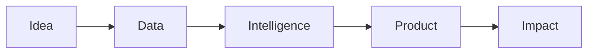

<!-- LIGHT GREEN BACKGROUND -->

  

---

  

## Who We Are
**Cognivibe Labs** is a next-generation technology studio building intelligent systems, advanced AI solutions, scalable data platforms, and production-ready digital products.

> We don’t just build software — we engineer intelligence.

---

##  What We Do

| Domain | Description |
|------|-------------|
🤖 **AI Systems** | Custom AI tools, LLM apps, automation agents |
📊 **Data Solutions** | Analytics pipelines, dashboards, data infrastructure |
🧠 **Machine Learning** | Predictive systems, model deployment, MLOps |
🌐 **Product Engineering** | Web apps, SaaS platforms, APIs |
📱 **Mobile Apps** | Cross-platform intelligent applications |
🎓 **Education** | Courses, training, developer resources |

---

## 🧭 Explore Our Work

---

## 🧪 Featured Repositories

| Project | Description | App |
|--------|-------------|
🔹 `coglex-ai` | Text Summarization, Expander, and OCR |  |
🔹 `dataforge` | End-to-end data engineering toolkit | |
🔹 `ml-deploykit` | Production ML deployment starter stack | |
🔹 `autoflow-ai` | Workflow automation powered by AI | |
🔹 `cognivibe-docs` | Technical documentation hub | |

---

## 🛠 Tech Stack

---

## 📡 Architecture Philosophy

---

## 🌍 Mission

> Build technology that thinks, learns, adapts, and scales with the world.

---

## 📫 Connect With Us

---

